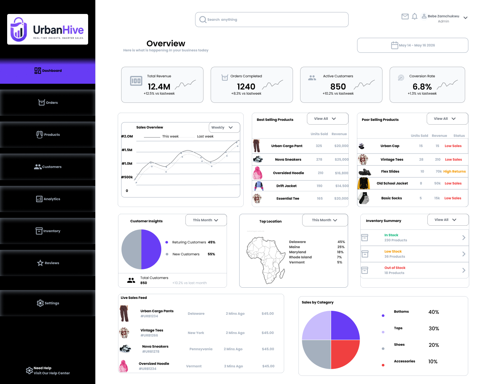

# UrbanHive – Fashion Analytics Dashboard



## Overview
UrbanHive is a modern fashion business analytics dashboard designed to help fashion brands track sales performance, monitor inventory, understand customer behavior, and make smarter business decisions through data visualization.

This project was created as part of my HexSoftwares Internship Task 2.

---

## Problem Statement
Many fashion businesses struggle to understand:
- Which products perform best
- What items are underperforming
- Customer buying behavior
- Revenue trends and inventory movement

Most business data is often scattered and difficult to interpret quickly.

---

## Solution
UrbanHive solves this problem by providing a clean and interactive dashboard that presents important business insights in a simple and organized way.

The dashboard helps brands:
- Track revenue growth
- Monitor best-selling products
- Identify low-performing products
- Analyze customer activity
- Manage inventory effectively

---

## Features
- Revenue Tracking
- Product Performance Analytics
- Inventory Monitoring
- Customer Insights
- Interactive Charts & Graphs
- Sales Trend Analysis
- Responsive Dashboard Layout

---

## Design Process
The design process focused on:
1. Understanding the business problem
2. Planning dashboard structure and hierarchy
3. Creating wireframes
4. Designing clean UI layouts
5. Using strong visual hierarchy for readability
6. Building intuitive user interactions

---

## Tools Used
- Figma
- UI/UX Design Principles
- Data Visualization Concepts

---

## Design Style
UrbanHive uses:
- Modern dark dashboard UI
- Purple gradient accents
- Minimal and clean layouts
- Card-based analytics sections
- Easy-to-read charts and metrics

---

## Key Learnings
Through this project, I improved my skills in:
- Dashboard design
- Data visualization
- UX thinking
- Layout structuring
- User-focused problem solving

---

## Conclusion
UrbanHive was designed to transform complex business data into simple and actionable insights for fashion brands. The goal was to create a dashboard experience that is both visually appealing and highly functional.
```
